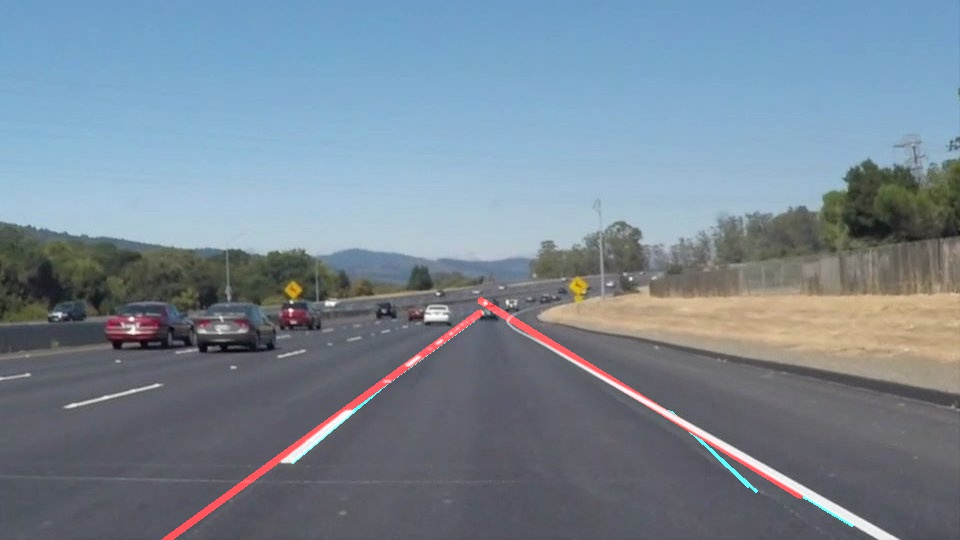
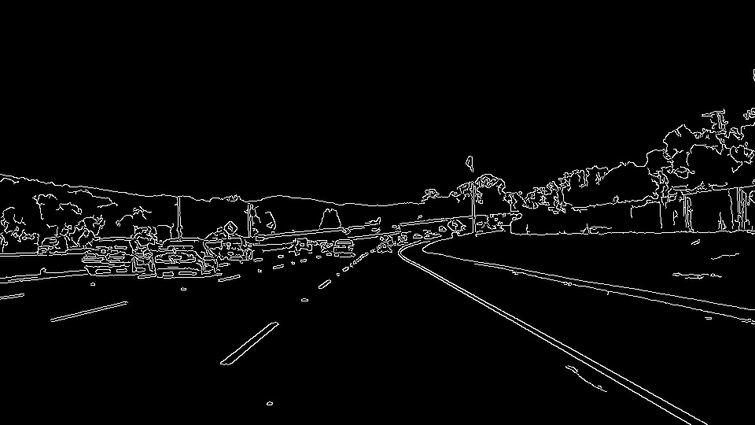

#**Finding Lane Lines on the Road** 

Overview
---

When we drive, we use our eyes to decide where to go.  The lines on the road that show us where the lanes are act as our constant reference for where to steer the vehicle.  Naturally, one of the first things we would like to do in developing a self-driving car is to automatically detect lane lines using an algorithm.

In this project I detect lane lines in images using Python and OpenCV.  OpenCV means "Open-Source Computer Vision", which is a package that has many useful tools for analyzing images.  

My pipeline consisted of 5 steps:
1. Blur the image to remove thin lines that could be caused by random chance or light reflection off the winshield
2. Convert to grayscale to prepare for canny edge detection
3. Apply Canny Edge Detection to find gradients on the grayscale picture
4. Find lines by using Hough Transformations
5. Remove horizontal lines that could be cauesd by windshield light reflection
6. Separate the right lane lines form left lane lines by detecting the line angles
7. Calculate the "mean" line for the left and right lane lines by finding the mean angle and running a line from a fixed x start and end point.

Here are a sequence of images to showcase the pipeline:
original_image:

Blured image:

Grayscaled image:

Cany Edge Image:

Area of interest Canny Image:

Hough Transformation with mean lines (mean lines in blue):

Image overlay of the original image with lines

---
#Installation

## If you have already installed the [CarND Term1 Starter Kit](https://github.com/udacity/CarND-Term1-Starter-Kit/blob/master/README.md) you should be good to go!   If not, you can install the starter kit or follow the install instructions below to get started on this project. ##

**Step 1:** Getting setup with Python

To run this project, you will need Python 3 along with the numpy, matplotlib, and OpenCV libraries, as well as Jupyter Notebook installed. 

I recommend downloading and installing the Anaconda Python 3 distribution from Continuum Analytics because it comes prepackaged with many of the Python dependencies you will need for this and future projects, makes it easy to install OpenCV, and includes Jupyter Notebook.

Choose the appropriate Python 3 Anaconda install package for your operating system <A HREF="https://www.continuum.io/downloads" target="_blank">here</A>.   Download and install the package.

If you already have Anaconda for Python 2 installed, you can create a separate environment for Python 3 and all the appropriate dependencies with the following command:

`>  conda create --name=yourNewEnvironment python=3 anaconda`

`>  source activate yourNewEnvironment`

**Step 2:** Installing OpenCV

Once you have Anaconda installed, first double check you are in your Python 3 environment:

`>python`    
`Python 3.5.2 |Anaconda 4.1.1 (x86_64)| (default, Jul  2 2016, 17:52:12)`  
`[GCC 4.2.1 Compatible Apple LLVM 4.2 (clang-425.0.28)] on darwin`  
`Type "help", "copyright", "credits" or "license" for more information.`  
`>>>`   
(Ctrl-d to exit Python)

run the following commands at the terminal prompt to get OpenCV:

`> pip install pillow`  
`> conda install -c menpo opencv3=3.1.0`

then to test if OpenCV is installed correctly:

`> python`  
`>>> import cv2`  
`>>>`  (i.e. did not get an ImportError)

(Ctrl-d to exit Python)

**Step 3:** Installing moviepy  

I recommend the "moviepy" package for processing video in this project (though you're welcome to use other packages if you prefer).  

To install moviepy run:

`>pip install moviepy`  

and check that the install worked:

`>python`  
`>>>import moviepy`  
`>>>`  (i.e. did not get an ImportError)

(Ctrl-d to exit Python)

**Step 4:** Opening the code in a Jupyter Notebook

You will run this project in a Jupyter notebook.  If you are unfamiliar with Jupyter Notebooks, check out <A HREF="https://www.packtpub.com/books/content/basics-jupyter-notebook-and-python" target="_blank">Cyrille Rossant's Basics of Jupyter Notebook and Python</A> to get started.

Jupyter is an ipython notebook where you can run blocks of code and see results interactively.  All the code for this project is contained in a Jupyter notebook. To start Jupyter in your browser, run the following command at the terminal prompt (be sure you're in your Python 3 environment!):

`> jupyter notebook`

A browser window will appear showing the contents of the current directory.  Click on the file called "P1.ipynb".  Another browser window will appear displaying the notebook.  Follow the instructions in the notebook to complete the project.  

**Step 5:** Complete the project and submit both the Ipython notebook and the project writeup

