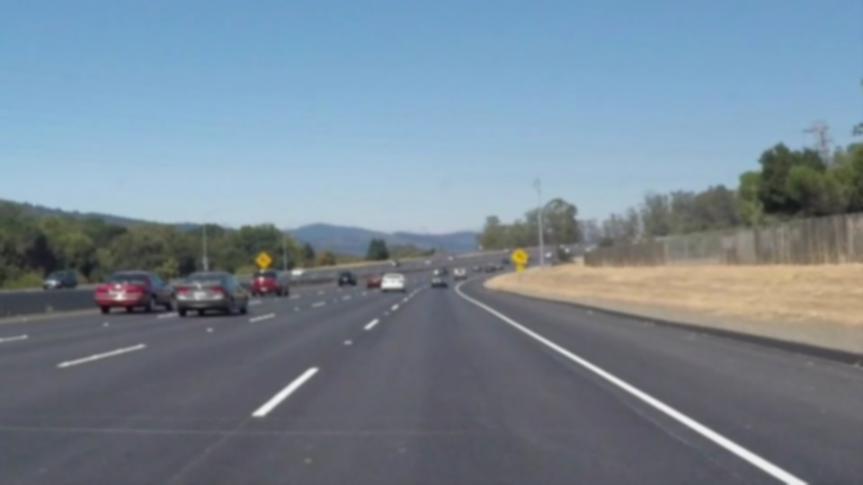
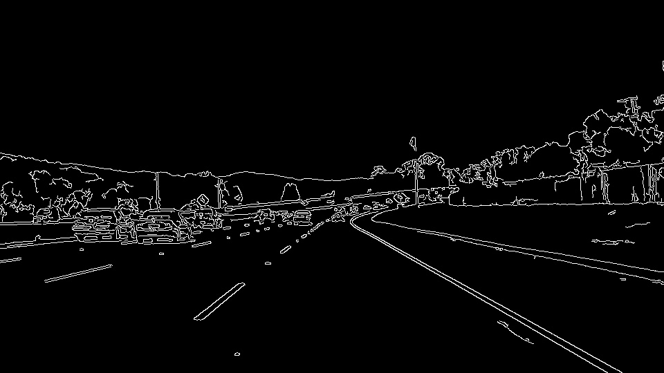
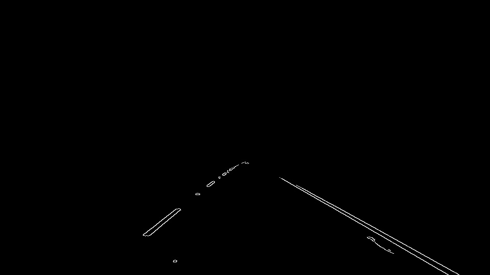
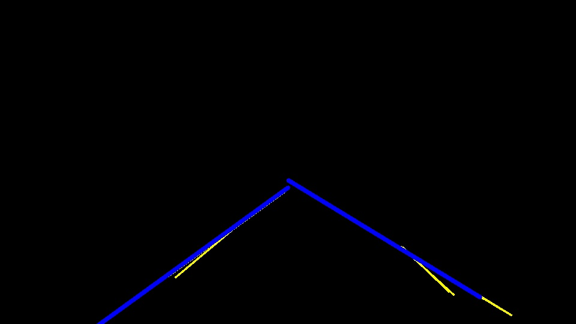
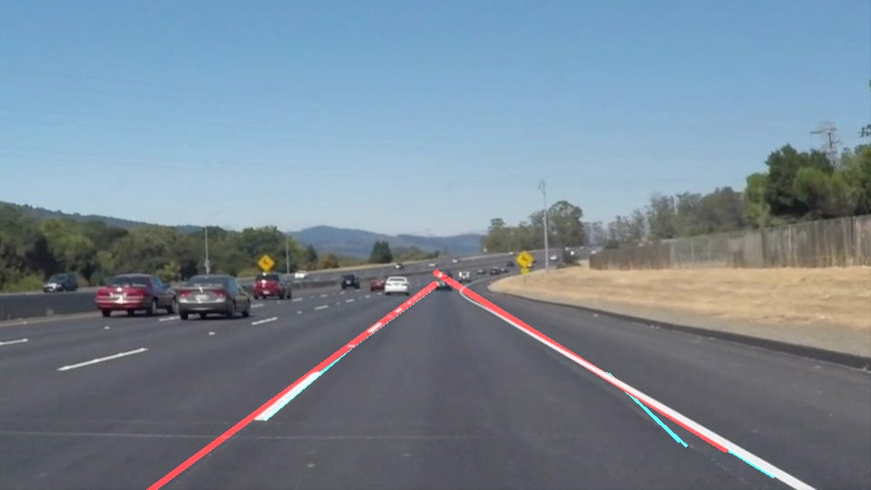

#**Finding Lane Lines on the Road** 
---

**Finding Lane Lines on the Road**

The goals / steps of this project are the following:
* Make a pipeline that finds lane lines on the road
* Reflect on my work in a written report

---

### Reflection

###1. Describe your pipeline. As part of the description, explain how you modified the draw_lines() function.

My pipeline consisted of 5 steps:
1. Blur the image to remove thin lines that could be caused by random chance or light reflection off the winshield
2. Convert to grayscale to prepare for canny edge detection
3. Apply Canny Edge Detection to find gradients on the grayscale picture
4. Find lines by using Hough Transformations
5. Remove horizontal lines that could be cauesd by windshield light reflection
6. Separate the right lane lines form left lane lines by detecting the line angles
7. Calculate the "mean" line for the left and right lane lines by finding the mean angle and running a line from a fixed x start and end point.

Here are a sequence of images to showcase the pipeline:
original_image:

Blured image:

Grayscaled image:

Cany Edge Image:

Area of interest Canny Image:

Hough Transformation with mean lines (mean lines in blue):

Image overlay of the original image with lines

###2. Identify potential shortcomings with your current pipeline

I believe my main problem lies in the fact that the algorithm is picking up some shadow or drifting lines that are not really part of the road lines. This can be caused from reflection from the windshield or general road conditions. I tried to metigate this by first bluring the image as much as possible (to remove small lines) and then removing any lines that are horizontal (since they tended to be lines of windshield reflection).

Furthermore, my lines seem to "jump" slightly like a drumstick. I still get some errors with the challenge video, and I think its mainly because of the shadows in the image. This could perhapd be solved with better image color tranformation, or more blur. I am unsure as to how to solve this issue with my current pipeline though. I would appreciate any comment or suggestion.

###3. Suggest possible improvements to your pipeline
The problem of detecting shadows or dift lines could be solved by having the lines be a weighted running mean of the previous lines thereby avoiding extreme movement of lines.